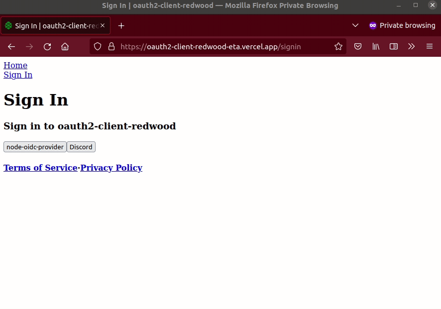

<h1 align="left">Welcome to Oauth2 Client Redwood 👋</h1>
<p align="left">
  <a href="#" target="_blank">
    
  </a>
</p>

> A feature-complete general-purpose OAuth2 client built using Redwood.

<p align="left">

</p>

## Providers available

Discord, Coinbase, Twitch, Chess.com, Plaid, and test provider.

To add a new provider, simply create a new file in the providers directory.

## Features

- [Authorization Code Grant Type](https://developer.okta.com/blog/2018/04/10/oauth-authorization-code-grant-type) with supoort for [OAuth2.1](https://oauth.net/2.1/) including [PKCE](https://www.oauth.com/oauth2-servers/pkce/)
- All providers can be used for *Authentication* (logins) or *Authorization* (user data)
- Web-side redirection UI
- No 3rd-party services required, and only one external dependency (pkce-challenge)
## Discussion 💬

Current discussion [here](https://community.redwoodjs.com/t/i-made-passportjs-for-redwood/4343?u=pi0neerpat) in the Redwood Community Forum.
## Demo ⏯️

https://oauth2-client-redwood-eta.vercel.app/login (please let me know if it doesn't work, Supabase pauses the database when not in use)

NOTE: after authentication, there's a bug where the the redirect to profile page may fail, and it appears to ask you to log in again. Simply navigate to /profile to see the user's data.

Test credentials for node-oidc-provider: `foo@example.com` password can be anything.

## Implement in your app

NOTE: if you're using a provider only for authorization, skip to step 3.

1. Setup dbAuth

```bash
yarn rw setup auth dbAuth
```

No need to follow the all instructions there, instead you will update the graphql schema as defined in step 3.

Also, create the session secret in your `.env` using `yarn rw g secret`

```
SESSION_SECRET=abc123
```

2. Install necessary dependencies

```bash
 cd api && yarn add pkce-challenge
```

3. Update the schema as necessary

Include any additional data from the provider you want to store in your database. For example, if you want to store the user's Twitch username, you can add it to the User model.

```graphql
model User {
  id           String   @id
  username     String?  @unique
  address      String?  @unique
  email        String?  @unique
  // --------------- STATE --------------
  createdAt    DateTime @default(now())
  updatedAt    DateTime @updatedAt
  refreshToken String?
  accessToken  String?
  OAuth        OAuth[]
  betaAccess   Boolean  @default(false)
}

model OAuth {
  state         String   @id
  codeChallenge String
  codeVerifier  String
  createdAt     DateTime @default(now())
  user          User?    @relation(fields: [userId], references: [id])
  userId        String?
}
```

4. Modify the provider files

In `api/src/lib/auth/providers/`, you'll find a files for each provider. You can copy one as a template for a new provider. Each provider has the following functions:

```js
// This is where your backend exchanges the grant for a access token from provider. Each provider has slightly different requirements, so be sure to ensure this is correct.
export const onSubmitCode = async (code, { memberId }) => {
    const body = {
      grant_type: 'authorization_code',
      client_id: process.env.COINBASE_CLIENT_ID,
      client_secret: process.env.COINBASE_CLIENT_SECRET,
      redirect_uri: COINBASE_REDIRECT_URI,
      code,
    }
    const encodedBody = encodeBody(body)
    const response = await fetch(COINBASE_OAUTH_URL_TOKEN, {
      method: 'post',
      body: encodedBody,
  //...
}

// This is the logic you want to process after a user is connected to the provider.
export const onConnected = async ({ accessToken, refreshToken, memberId }) => {
    const userDetails = await fetch('https://api.coinbase.com/v2/user', {
      headers: {
        Authorization: `Bearer ${accessToken}`,
        'CB-VERSION': '2022-11-22',
      },
    }).then((res) => {
      if (res.status != 200)
        throw 'Coinbase authorization failed, or secret invalid'
      return res.json()
    })
    const user await db.user.create({
    // ...

    // NOTE: you may need to modify return value here:
    // For authentication use-cases, it should return the user object.
    // For authorization it can simply return `{ status: 'SUCCESS' }`.
    return user
```

Here are the current providers available, and they can each be modified to fit your needs.
#### Authentication

- **Discord** (PKCE req.): Create a user with their Discord profile, email, handle, and avatar for creating a user.
- **Chess.com**: Create a user with their Chess.com profile, email, handle, and avatar for creating a user.
- **Keyp** (in development): Create a new user with their wallet address.
- **Node OIDC** (PKCE req.): A demo provider using [node-oidc-provider](https://github.com/panva/node-oidc-provider-example). I am hosting this for the demo, or you can run it locally yourself (repo [here](https://github.com/UseKeyp/node-oidc-provider-example))

Note if you are using a provider for authentication, you will need add it to the web [redirection provider](https://github.com/pi0neerpat/oauth2-client-redwood/blob/559da2f738a9755405a2a2cf800ca5fca5c23835/web/src/providers/redirection/redirection.js#L9) so that the appropriate query is made upon redirection back to the app.

#### Authorization

- **Coinbase**: Grab their ethereum deposit address.
- **Twitch**: Grab their Twitch username.
- **Plaid**: Grab their Plaid link_token to use with an approved app. (Plaid is evil and you should avoid using them)

5. Cleanup tasks

If you created a new provider, be sure its exported properly in `api/src/lib/auth/providers/index.js`.

If you're using a provider for Authenticaion, you will need to do the following:

- Add the provider as an option in `api/src/lib/auth/validation.js`
- Add the provider as an option to `SigninPage.js` and `APPROVED_LOGIN_PROVIDERS` in `web/src/providers/redirection/redirection.js`

## Next steps

- [ ] Add revokation feature to frontend
- [ ] Add more providers, and have them working in the demo (your help needed!)
- [ ] Simplify code (maybe make it a package?) and improve documentation
- [ ] Improve the UI
- [ ] Fix redirect bug to /profile
- [ ] Security audit

## Contributing 💡

To run this repo locally:

- Update your .env from `.env.example`. There are two test servers included.
## Resources 🧑‍💻

- OAuth 2.0 https://oauth.net/2/
- OAuth Server libraries: https://oauth.net/code/nodejs/
- oidc-client-ts https://github.com/authts/oidc-client-ts
- oauth4webapi https://github.com/panva/oauth4webapi
- openid-client https://github.com/panva/node-openid-client
- node-oidc-provider https://github.com/panva/node-oidc-provider
- https://authguidance.com/

## Sponsors ❤️

[][sponsor-keyp] Improve onboarding and payments in your games & web3 apps effortlessly with OAuth logins for wallets and debit card transactions. [Create a Keyp account; it's free!][sponsor-keyp]<br><br>

## License 📝

Copyright © 2023 Nifty Chess, Inc.<br />
This project is MIT licensed.

[sponsor-keyp]: https://UseKeyp.com


