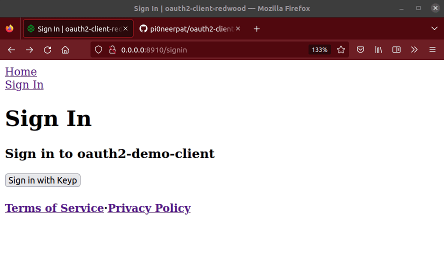

<h1 align="center"></h1>
<h1 align="center">Welcome to OAuth Client Redwood 👋</h1>
<p align="center">
  <a href="#" target="_blank">
    
  </a>
  <a href="https://twitter.com/UseKeyp" target="_blank">
    
  </a>
</p>

If you'd like to join our team please let us know. Happy hacking!

<p align="center">

</p>

> A feature-complete general-purpose OAuth2 client built using Redwood.

## Providers available

Discord, Coinbase, Twitch, Chess.com, Plaid, and a demo provider using node-oidc-provider.

To add any new provider, simply create a new file in the providers directory.

## Features

- [Authorization Code Grant Type](https://developer.okta.com/blog/2018/04/10/oauth-authorization-code-grant-type) with support for [PKCE](https://www.oauth.com/oauth2-servers/pkce/)
- All providers can be used for *Authentication* or *Authorization*
- Web-side redirection UI
- No 3rd-party services required, and only one external dependency (pkce-challenge)
## Discussion 💬


This builds upon previous the work "wrapped dbAuth" (as first introduced in the community forum post [Combining dbAuth + OAuth2](https://community.redwoodjs.com/t/combining-dbauth-oauth2/2452/8)). Current discussion is happening in the [Redwood Community Forum post](https://community.redwoodjs.com/t/i-made-passportjs-for-redwood/4343?u=pi0neerpat)

## Demo 📙


For node-oidc-provider example, the test user email is `foo@example.com`, and password is anything.

## Implement in your app

NOTE: if you're using a provider only for authorization, skip to step 3.

1. Setup dbAuth

```bash
yarn rw setup auth dbAuth
```

No need to follow the all instructions there, instead you will update the graphql schema as defined in step 3.

Also, create the session secret in your `.env` using `yarn rw g secret`

```
SESSION_SECRET=abc123
```

2. Install necessary dependencies

```bash
 cd api && yarn add pkce-challenge
```

3. Update the schema as necessary

Include any additional data from the provider you want to store in your database. For example, if you want to store the user's Twitch username, you can add it to the User model.

```graphql
model User {
  id           String   @id
  username     String?  @unique
  address      String?  @unique
  email        String?  @unique
  // --------------- STATE --------------
  createdAt    DateTime @default(now())
  updatedAt    DateTime @updatedAt
  refreshToken String?
  accessToken  String?
  OAuth        OAuth[]
  betaAccess   Boolean  @default(false)
}

model OAuth {
  state         String   @id
  codeChallenge String
  codeVerifier  String
  createdAt     DateTime @default(now())
  user          User?    @relation(fields: [userId], references: [id])
  userId        String?
}
```

4. Modify the provider files

This is where you'll decide what you want to happen once a user is connected to the provider. For example, you may want to create a new user in your database (authentication use-case), or you may want to supplement an existing user with new data from the provider (authorization use-case).

Here's how the current example providers are currently set up, but they can be changed to fit your needs.

5. Cleanup tasks

If you created a new provider, be sure its exported properly in `api/src/lib/auth/providers/index.js`.

If you're using a provider for Authenticaion, you will need to do the following:

- Add the provider as an option in `api/src/lib/auth/validation.js`
- Add the provider as an option to `SigninPage.js` and `APPROVED_LOGIN_PROVIDERS` in `web/src/providers/redirection/redirection.js`

#### Authentication

- **Discord** (PKCE req.): Create a user with their Discord profile, email, handle, and avatar for creating a user.
- **Chess.com**: Create a user with their Chess.com profile, email, handle, and avatar for creating a user.
- **Keyp** (in development): Create a new user with their wallet address.
- **Node OIDC** (PKCE req.): A demo provider using [node-oidc-provider](https://github.com/panva/node-oidc-provider-example). I am hosting this for the demo, or you can run it locally yourself (repo [here](https://github.com/UseKeyp/node-oidc-provider-example))

Note if you are using a provider for authentication, you will need add it to the web [redirection provider](https://github.com/pi0neerpat/oauth2-client-redwood/blob/559da2f738a9755405a2a2cf800ca5fca5c23835/web/src/providers/redirection/redirection.js#L9) so that the appropriate query is made upon redirection back to the app.

#### Authorization

- **Coinbase**: Grab their ethereum deposit address.
- **Twitch**: Grab their Twitch username.
- **Plaid**: Grab their Plaid link_token to use with an approved app. (Plaid is evil and you should avoid using them)
## Next steps

- [ ] Add more providers, and have them working in the demo (your help needed!)
- [ ] Simplify code and improve documentation
- [ ] Security audit

## Resources 🧑‍💻

- OAuth 2.0 https://oauth.net/2/
- OAuth Server libraries: https://oauth.net/code/nodejs/
- oauth4webapi https://github.com/panva/oauth4webapi
- node-oidc-provider https://github.com/panva/node-oidc-provider
- openid-client https://github.com/panva/node-openid-client
## Contributors ✨

👤 **Keyp Team <maintainers@UseKeyp.com>**

- Website: https://UseKeyp.com
- Twitter: [@UseKeyp](https://twitter.com/UseKeyp)
- GitHub: [@UseKeyp](https://github.com/UseKeyp)

## License 📝

Copyright © 2022 Nifty Chess, Inc.<br />
This project is MIT licensed.


